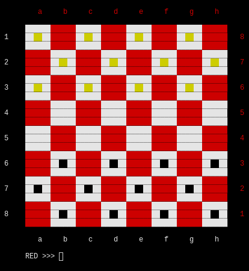

<!-- https://codinhood.com/nano/git/center-images-text-github-readme-->
<h1 align="center" style="font-size:72px">Rusty Checkers</h1>

> THIS IS IN PRODUCTION: currently not stable

<!--https://stackoverflow.com/questions/12090472/how-do-i-center-an-image-in-the-readme-md-file-on-github-->

        

This is a simple checkers game board written in rust for the Unix terminal, but
may be ported to other terminals.

Name Pending

1. [Instillation](#install)
    1. [Build from source](#source)
2. [How to use](#use)

# How to install rusty checkers.

> It is currently not, since this is nowhere near production, in any
> repository, of my knowledge, and you will have to build this from scratch.

## How to install rusty checkers.

<h5>installing rust</h5>

To install this program you will have to have [Rust](https://www.rust-lang.org/) 
installed on your system.
I suggest that you install via [Rustup](https://rustup.rs/)'s convenient one
liner:

        curl --proto '=https' --tlsv1.2 -sSf https://sh.rustup.rs | sh

But you could just as easily download it from your distributions package manager
and or by installing cargo, I bet there are other ways.

<h5>installing rust</h5>

After the installation of rust, you can now compile this project.
I will be demonstrating with the cargo rust compiler, now to compile you will
need to run:

        cargo build --release

After which it it will save to target/release/rustycheckers.

Now you could stop here, or you could go further by moving it to your user binary
file, so you do not have to navigate to this directory every time you want to
use it in the terminal unaware. To accomplish this you will need to run a
singular command, with the right privileges, to move or copy the binary to the
correct directory.

To move it:
        mv target/release/rustycheckers /usr/local/bin/rustycheckers

To copy it:
        cp target/release/rustycheckers /usr/local/bin/rustycheckers

And now you have it, now you can play checkers in your terminal with or without
you very real friends.

# How to use rusty checkers.

To use rusty checkers you will first have to [install it](#install), and after
that you can learn the nuances of using this terminal application.

I am not going to teach you to play the game but if you do not know you can look
it up, or go [here](https://duckduckgo.com/) to find out.

So there is an indicator by the prompt to tell you whose turn it is, either
black or reds. On this board red is yellow so that it wont blend into the board
and you can actually play.

You can move your pieces by giving the continents of the piece you want to move
and where you want it to move to. For example:

        RED >>> 3 c 4 d

This moves the piece at 3 c to 4 d.

Now the there's the keyword kill, which will kill a singular piece of
your team.

        RED >>> kill 1h
        

And if you want to quit just type

        quit

# What To Implement.<a name="future">

1. ~~Accept alphanumerics as input~~
2. ~~Ability to kill another piece~~
3. Ability to play over a network
        - So needs a new function and creation functions
4. more styles of board _currently only fancy_
5. clear keyword to reset the board

