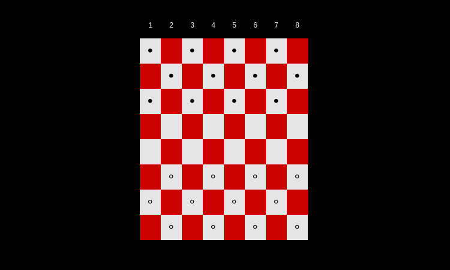

<!-- https://codinhood.com/nano/git/center-images-text-github-readme-->
<h1 align="center" style="font-size:72px">Rusty Checkers</h1>

////////////////////////////////////////////////////////////// 
WARNING: Under Construction 
\\\\\\\\\\\\\\\\\\\\\\\\\\\\\\\\\\\\\\\\\\\\\\\\\\\\\\\\\\\\\\

<!--https://stackoverflow.com/questions/12090472/how-do-i-center-an-image-in-the-readme-md-file-on-github-->

        

This is a simple checkers game board written in rust for the Unix terminal, but
may be ported to other terminals.

Name Pending

1. [Instillation](#install)
    1. [install rust](#install)
    1. [Build from source](#building)
2. [How to use](#use)
3. [Whats next](#future)

# How to install rusty checkers.

> It is currently not, since this is nowhere near production, in any
> repository, of my knowledge, and you will have to build this from scratch.

## How to install rusty checkers.

<h5>installing rust</h5>

To install this program you will have to have [Rust](https://www.rust-lang.org/) 
installed on your system.
I suggest that you install via [Rustup](https://rustup.rs/)'s convenient one
liner:

        curl --proto '=https' --tlsv1.2 -sSf https://sh.rustup.rs | sh

But you could just as easily download it from your distributions package manager
and or by installing cargo, I bet there are other ways.

<h5>compiling</h5>

After the installation of rust, you can now compile this project.
I will be demonstrating with the cargo rust compiler, now to compile you will
need to run:

        cargo build --release

After which it it will save to target/release/rustycheckers.

Now you could stop here, or you could go further by moving it to your user binary
file, so you do not have to navigate to this directory every time you want to
use it in the terminal unaware. To accomplish this you will need to run a
singular command, with the right privileges, to move or copy the binary to the
correct directory.

To move it:
        mv target/release/rustycheckers /usr/local/bin/rustycheckers

To copy it:
        cp target/release/rustycheckers /usr/local/bin/rustycheckers

And now you have it, now you can play checkers in your terminal with or without
you very real friends.

# How to use rusty checkers.

To use rusty checkers you will first have to [install it](#install), and after
that you can learn the nuances of using this terminal application.

I am not going to teach you to play the game but if you do not know you can look
it up, or go [here](https://duckduckgo.com/) to find out.

To use the program you can move as many pieces as you want until you end your
turn. To kill a piece just type its placement.

## Keys

<table>
<tbody>
        <tr>
                <td>Keybindings </td>
                <td>&nbsp;Action</td>
        </tr><tr>
                <td>q</td>
                <td>Quit  </td>
        </tr><tr>
                <td>h  </td>
                <td>prints out help (currently not working)  </td>
        </tr><tr>
                <td>r </td>
                <td>Reset Pieces  </td>
        </tr>
        
        <tr>
                <td>&lt;SHIFT&gt;-H </td>
                <td>&nbsp;Move Window Left </td>
        </tr><tr>
                <td>&lt;SHIFT&gt;-L </td>
                <td>&nbsp;Move Window In Rigth </td>
        </tr><tr>
                <td>&lt;SHIFT&gt;-J </td>
                <td>&nbsp;Move Window Down </td>
        </tr><tr>
                <td>&lt;SHIFT&gt;-K </td>
                <td>&nbsp;Move Window In Up </td>
        </tr>
        
        <tr>
                <td>&nbsp;1..8</td>
                <td>move pieces col, then row  </td>
        </tr><tr>
                <td>&nbsp;&lt;tab&gt; / : </td>
                <td>move to settings module </td>
        </tr><tr>
                <td>&lt;enter&gt;</td>
                <td>next turn  </td>
        </tr>
</tbody>
</table>

# What To Implement.<a name="future">

- [ ] Accept alphanumerics as input
- [ ] Ability to play over a network
        - So needs a new function and creation functions
- [ ] Clear keyword to reset the board
- [ ] Add help
- [ ] Add key map show
- [ ] Enforce Number of pieces, configurable.
- [ ] Stop placement of pieces over or under other pieces 
- [X] Ability to kill another piece - ~~if piece true then false~~
